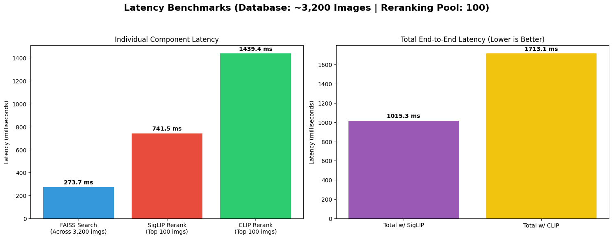

# Intelligent Fashion Search Engine

A multimodal fashion image retrieval system built to understand complex, multi-attribute, and context-aware natural language queries. 

Unlike standard zero-shot vision-language models (like vanilla CLIP) which often struggle with compositional attributes (e.g., distinguishing a "red shirt with blue pants" from a "blue shirt with red pants"), this system utilizes a highly precise two-stage pipeline: a **semantic canonicalization + dense vector search** followed by a **CLIP-based visual re-ranking**.

## Architecture

The system is split into two distinct workflows: the offline indexing pipeline and the online retrieval pipeline.

### 1.Indexing Pipeline
*Runs once to process raw images into searchable representations.*

```text
                         Fashion Image Dataset
                                 │
                                 ▼
                  ┌────────────────────────────────┐
                  │ ① Qwen3-VL-2B-Instruct         │
                  │ Vision-Language Model          │
                  │ Image → Rich Caption           │
                  └────────────────────────────────┘
                                 │
                                 ▼
      "blue patterned jacket, white top, blue plaid trousers,
              brown beret on orange background"
                                 │
                                 ▼
                  ┌────────────────────────────────┐
                  │ ② Qwen2.5-0.5B-Instruct        │
                  │ Text Normalization             │
                  └────────────────────────────────┘
                                 │
                                 ▼
      blue patterned jacket | white top | blue plaid trousers | brown beret
                                 │
                                 ▼
                  ┌────────────────────────────────┐
                  │ ③ BGE-M3                       │
                  │ Text Encoder                   │
                  │ 1024-D Dense Vector            │
                  └────────────────────────────────┘
                                 │
               ┌─────────────────┴──────────────────┐
               │                                    │
               ▼                                    ▼
      ┌─────────────────────┐          ┌────────────────────────────┐
      │ FAISS HNSW Index    │          │ PostgreSQL Database        │
      │ Dense Vectors       │          │ (Relational Data Storage)  │
      │ Vector Database     │          └─────────────┬──────────────┘
      │ [0.12, 0.51, ...]   │                        │ (Exported)
      └─────────────────────┘                        ▼
                                       ┌────────────────────────────┐
                                       │ DataFrame / Parquet        │
                                       │ image_path                 │
                                       │ original_caption           │
                                       │ faiss_id                   │
                                       └────────────────────────────┘
```

### 2. Retrieval Pipeline
*Real-time search handling user queries.*

```text
                    User Query
                         │
                         ▼
     "blue jacket with white top"
                         │
                         ▼
           ┌──────────────────────────────┐
           │ ④ Qwen2.5-0.5B-Instruct      │
           │ Query Normalization          │
           └──────────────────────────────┘
                         │
                         ▼
               blue jacket | white top
                         │
                         ▼
           ┌──────────────────────────────┐
           │ ⑤ BGE-M3                     │
           │ Text Encoder                 │
           │ Query Embedding (1024-D)     │
           └──────────────────────────────┘
                         │
                         ▼
              ┌──────────────────────┐
              │ FAISS HNSW           │
              │ Cosine Similarity    │
              │ Top-N Vector Search  │
              └──────────────────────┘
                         │
                         ▼
        Top-N Candidates (Metadata + Image Paths)
                         │
                         ▼
=========================================================
                    CLIP RE-RANKING
=========================================================
                         │
                         ▼
        ┌──────────────────────────────────┐
        │ SigLIP / CLIP Image & Text       │
        │ Cross-modal Similarity           │
        └──────────────────────────────────┘
                         │
                         ▼
                Final Ranked Images
```


---

## Project Structure

```text
Fashion_search_engine/
├── core/
│   ├── indexing_pipeline.ipynb   # Colab notebook for the offline indexing pipeline
│   ├── retrieval_pipeline.ipynb  # Colab notebook for the online retrieval pipeline
│   ├── fashion_search_hnsw.faiss # Generated FAISS vector index
│   └── images_metadata.parquet   # Metadata mapping FAISS IDs to image paths/captions
├── data/
│   └── val_test2020/
│       └── test/                 # Raw fashion images go here
├── requirements.txt
└── README.md
```

---

## Local Setup Instructions

If you prefer to run this project locally (e.g., on a machine with a dedicated GPU), follow these steps:

### 1. Clone the Repository
```bash
git clone https://github.com/your-username/Fashion_search_engine.git
cd Fashion_search_engine
```

### 2. Set Up a Virtual Environment
It is highly recommended to use a virtual environment to manage dependencies:
```bash
python3 -m venv venv
source venv/bin/activate  # On Windows, use: venv\Scripts\activate
```

### 3. Install Dependencies
Install the required packages from `requirements.txt`:
```bash
pip install -r requirements.txt
```
*Note: Depending on your system and hardware, you might need to install PyTorch separately to ensure it is configured correctly for your GPU (CUDA) or CPU. Refer to the [official PyTorch installation guide](https://pytorch.org/get-started/locally/).*

### 4. Data Preparation
Ensure the generated index (`fashion_search_hnsw.faiss`), metadata (`images_metadata.parquet`), and the image dataset are placed correctly within the project directory as referenced in the notebooks/scripts.

### 5. Running Locally
You can run the Jupyter notebooks (`indexing_pipeline.ipynb` and `retrieval_pipeline.ipynb`) using Jupyter Lab or Jupyter Notebook:
```bash
pip install jupyterlab
jupyter lab
```


---

## Google Colab Setup Instructions

This project was developed, indexed, and retrieved entirely within **Google Colab**, with all data and databases hosted in **Google Drive**.


### 1. Compute Requirements (Colab)
- **Indexing Phase:** The dataset of 3,200 images was indexed using an **A100 GPU** via Colab Compute Units. Utilizing batching, the entire heavy-lifting process (Qwen3-VL captioning + BGE-M3 embedding) took approximately **30-40 minutes**.
- **Retrieval Phase:** The online search pipeline is lightweight and was successfully run on Colab's **T4 Free Tier**.

### 2. Google Drive Data Preparation
To run the notebooks, you must mount your Google Drive to your Colab session. You can download the pre-computed FAISS index, metadata, and dataset directly from **[this Google Drive folder](https://drive.google.com/drive/folders/1AJW-zH023vryszWsiLJfq1OHdrp54qJW?usp=drive_link)**. 

Ensure your directory structure in your own Google Drive looks exactly like this after downloading:

```text
/content/drive/MyDrive/Fashion_search_engine/
├── fashion_search_hnsw.faiss       # The pre-computed FAISS vector index
├── images_metadata.parquet         # Metadata and canonical captions
└── data/
    └── val_test2020/
        └── test/                   # The raw .jpg / .png image dataset
```

### 3. Notebook Execution
To execute the pipelines in Colab:
1. Open the retrieval notebook (e.g., `retrieval_pipeline.ipynb`) in Google Colab.
2. Run the first cell to mount your Drive:
   ```python
   from google.colab import drive
   drive.mount('/content/drive')
   ```
3. Run the setup cells to download the required dependencies (Transformers, FAISS, Accelerate, etc.).

---

## Running the Search Engine in Colab

Inside the retrieval notebook, execute the cells sequentially:

1. The notebook will first load the FAISS index and Pandas DataFrame directly from your mounted Google Drive (`/content/drive/MyDrive/Fashion_search_engine/`).
2. It will download and load the necessary Hugging Face models into the T4 GPU memory (Qwen2.5, BGE-M3, and SigLIP).
3. Once initialized, you can modify the `query` variable in the search cell to enter a natural language fashion query.

**Example Queries to Try:**
- *"A person in a bright yellow raincoat."*
- *"Professional business attire inside a modern office."*
- *"Someone wearing a blue shirt sitting on a park bench."*
- *"Casual weekend outfit for a city walk."*
- *"A red tie and a white shirt in a formal setting."*

## Models Used

Here is a breakdown of the models powering the system, why they were chosen, and where to find them:

| Model | Pipeline Stage | Purpose | Link |
| --- | --- | --- | --- |
| **Qwen3-VL-2B-Instruct** | Indexing | Acts as a Vision-Language Model (VLM) to extract rich, descriptive, and factual captions from raw fashion images (garments, colors, styles, environment). | [Qwen/Qwen3-VL-2B-Instruct](https://huggingface.co/Qwen/Qwen3-VL-2B-Instruct) |
| **Qwen2.5-0.5B-Instruct** | Indexing & Retrieval | Performs semantic text normalization. In indexing, it converts raw captions into structured keywords. In retrieval, it canonicalizes natural language user queries to match the indexed format. | [Qwen/Qwen2.5-0.5B-Instruct](https://huggingface.co/Qwen/Qwen2.5-0.5B-Instruct) |
| **BGE-M3** | Indexing & Retrieval | State-of-the-art dense text embedding model used to convert the canonicalized text into 1024-D vectors for efficient and scalable FAISS similarity search. | [BAAI/bge-m3](https://huggingface.co/BAAI/bge-m3) |
| **SigLIP2-Base (Patch16-224)**| Retrieval | Used for cross-modal visual re-ranking (Stage 2). Evaluates the actual image-to-text similarity for the top 100 candidates retrieved by FAISS to ensure high precision and visual relevance. | [google/siglip2-base-patch16-224](https://huggingface.co/google/siglip2-base-patch16-224) |

---

## Technical Approach & Trade-offs

### Why a Two-Stage Pipeline vs. Pure CLIP?
Standard zero-shot CLIP models are incredibly fast for image retrieval, but they have a major limitation: they act like a "bag of words." If you query "a blue shirt and red pants," CLIP often returns images of "a red shirt and blue pants" because it struggles with **compositional logic** (binding specific colors/attributes to specific garments). It also struggles to separate background context from the clothing itself.

To solve this, we structured the pipeline into two stages:

1. **Stage 1 (High Recall & Semantic Precision):** Instead of using vision-language embeddings for the initial search, we use **Qwen3-VL** to extract factual text captions and embed those using **BGE-M3** (a dense text model). This ensures the initial Top-100 results strictly contain the correct items in the correct colors.
2. **Stage 2 (High Precision & Visual Grounding):** Text search alone cannot evaluate aesthetic quality, fit, or visual layout. We apply a **SigLIP/CLIP** model to cross-examine the text query against the actual image pixels for only the top 100 candidates. This acts as a highly refined visual filter.

### The Role of SigLIP2
For the visual re-ranking step, we use **SigLIP2** (`google/siglip2-base-patch16-224`) rather than standard OpenAI CLIP. 
- **Standard CLIP** uses a softmax loss function, which requires pairwise comparisons across the entire batch, sometimes forcing the model to make artificial distinctions.
- **SigLIP** (Sigmoid Loss for Language Image Pre-Training) evaluates the image-text match independently using a sigmoid loss. This makes it far better at handling complex, multi-attribute descriptions, noisy data, and finer-grained details, making it the perfect re-ranker for complex fashion queries.

### Evaluation (Precision@5)

To measure the effectiveness of our retrieval pipeline, we track the **Precision at 5 (P@5)** metric, which represents the proportion of relevant images within the top 5 search results. 

The table below summarizes the P@5 scores across various categories of query complexity. Our two-stage system (utilizing SigLIP2) achieves perfect top-5 precision across the board, demonstrating strong robustness on challenging compositional and contextual searches.

| Query Types | Our System (SigLIP2) P@5 | CLIP P@5 |
| :--- | :---: | :---: |
| Attribute Specific | 1.00 | 1.00 |
| Contextual/Place | 1.00 | 1.00 |
| Complex Semantic | 1.00 | 1.00 |
| Style Inference | 1.00 | 1.00 |
| Compositional | 1.00 | 1.00 |

### Latency Analysis


### Scalability

The retrieval logic is inherently designed for massive scale because of the architectural split:

*   **Storage & Search:** The dense text embeddings are stored in a **FAISS HNSW index**. HNSW (Hierarchical Navigable Small World) is an approximate nearest neighbor search algorithm that scales effortlessly to billions of vectors with sub-millisecond retrieval times. Searching 1 million vectors takes practically the same time as searching 1,000.
*   **Compute:** The computationally expensive part (Qwen3-VL extracting captions) is strictly an *offline process* that happens only once when an image is ingested. During real-time retrieval, the system only embeds a short text query (using a lightweight model) and does a FAISS lookup.
*   **Re-ranking:** The SigLIP vision model only ever processes the Top-100 candidates returned by FAISS. Even with 1 million images in the database, the heavy lifting at runtime is capped at exactly 100 images, allowing it to run in real-time on standard consumer hardware.

#### Code-Level Mapping of Scalability

Here is how the system's architecture supports massive scale in the code:

**1. Storage & Search (FAISS HNSW)**
In `core/indexing_pipeline.ipynb`, the FAISS index is explicitly configured to use `IndexHNSWFlat`. HNSW builds a graph-based structure that allows for logarithmic search time ($O(\log N)$) rather than linear search time, meaning searching 1,000,000 items is barely slower than searching 1,000.
```python
        # 4. FAISS index (HNSW for approximate search — scales better than flat index)
        embedding_dim = 1024
        USE_HNSW = True
        if USE_HNSW:
            base_index = faiss.IndexHNSWFlat(embedding_dim, 32, faiss.METRIC_INNER_PRODUCT)
        else:
            base_index = faiss.IndexFlatIP(embedding_dim)
            
        index = faiss.IndexIDMap(base_index)
```
At runtime in `core/retrieval_pipeline.ipynb`, this translates to a single sub-millisecond call that instantly filters the entire database down to a manageable size:
```python
    # Instantly searches the entire database for the top candidates
    distances, indices = index.search(query_vector, candidate_pool_size)
```

**2. Compute Efficiency (Offline Heavy-Lifting vs. Online Lightweight Querying)**
The computationally expensive VLM (`Qwen3-VL`) and LLM processing runs purely offline inside the `indexing_pipeline.ipynb` batching loops. 
During real-time retrieval (`core/retrieval_pipeline.ipynb`), the system never runs a massive generative model. It only runs the lightweight embedding model (`BGE-M3`) on a short text query, which takes milliseconds:
```python
def search_fashion(query, top_k=5, candidate_pool_size=100):
    # Only lightweight text processing happens online
    canonical_query = normalize_text(query)
    embed_output = embed_model.encode([canonical_query], max_length=8192)
```

**3. Bounded Re-ranking (Capping the Vision Model)**
Passing raw images through a vision-language model like SigLIP is slow. If we ran SigLIP on the entire database at runtime, it would take hours. Instead, in `core/retrieval_pipeline.ipynb`, the parameter `candidate_pool_size` hard-caps the heavy lifting at exactly 100 images, making runtime complexity $O(1)$ relative to the database size.
```python
def search_fashion(query, top_k=5, candidate_pool_size=100):
    # ... FAISS returns maximum 100 items ...
    
    # SigLIP heavy lifting is strictly capped at len(candidates_df) <= 100
    print(f"🚀 Re-ranking {len(candidates_df)} candidates using SigLIP...")
    
    inputs = siglip_processor(
        text=[query],
        images=candidate_images,  # This array never exceeds 100 images
        padding="max_length",
        return_tensors="pt"
    ).to(device)
```

---

### Zero-Shot Capability

**The system handles unseen descriptions exceptionally well, acting with true zero-shot capability.**

*   Because we do not use fixed, pre-defined classes or rigid training labels, the vocabulary is unbounded. 
*   **VLM World Knowledge:** Qwen3-VL has vast world knowledge and can describe novel, rare, or highly specific fashion items (e.g., "gorpcore aesthetic", "Y2K style low-rise jeans") even if they aren't standard fashion terminology.
*   **Semantic Dense Embeddings:** BGE-M3 maps meaning to vector space, not exact strings. If a user searches for a "maroon jumper", the embedding model knows semantically that this is exceptionally close to a "dark red sweater" in a generated caption, handling synonyms and unseen phrasing combinations flawlessly.
*   **Visual Generalization:** SigLIP natively handles zero-shot visual matching, ensuring that novel visual attributes requested by the user are still evaluated correctly in the final ranking step.

#### Code-Level Mapping of Zero-Shot Capabilities

Here is how those zero-shot capabilities map directly to the code in the pipeline notebooks:

**1. Unbounded Vocabulary via VLM (Zero-Shot Text Generation)**
Instead of forcing the images into predefined classes, we use **Qwen3-VL** to dynamically generate completely unbounded text for every image (`core/indexing_pipeline.ipynb`).
```python
    prompt = """
You are a professional fashion image caption generator for an intelligent fashion search engine.
... [Prompt Continues]
"""
    # Zero-shot generation without explicit training labels!
    with torch.no_grad():
        generated_ids = vlm_model.generate(**inputs, max_new_tokens=128, do_sample=False)
```

**2. Semantic Dense Embeddings (Handling Unseen Descriptions)**
We convert the textual attributes into a dense semantic vector so the system can match meaning rather than exact strings. 

In `core/indexing_pipeline.ipynb`, we embed the canonical captions offline:
```python
        # Step 3 : BGE-M3 Embedding (Batch)
        embedding_dict = embed_model.encode(normalized_captions, max_length=8192)
        embeddings = np.asarray(embedding_dict["dense_vecs"], dtype=np.float32)
```
At runtime in `core/retrieval_pipeline.ipynb`, we embed the user's natural language query using the exact same semantic model. Because BGE-M3 understands semantic similarity, a query for "maroon jumper" naturally finds vectors close to it in multidimensional space (like a "dark red sweater").

**3. Visual Generalization via SigLIP (Zero-Shot Visual Matching)**
Even after narrowing down to the top 100 semantically matching text results, the system takes the raw user query and the *actual images* to run a final zero-shot visual similarity score in `core/retrieval_pipeline.ipynb`:
```python
    # Pass the RAW user text and the RAW images to SigLIP
    inputs = siglip_processor(text=[query], images=candidate_images, padding="max_length", return_tensors="pt").to(device)

    # SigLIP natively evaluates the zero-shot alignment between the novel text and the pixels
    with torch.no_grad():
        outputs = siglip_model(**inputs)
        logits = outputs.logits_per_image.squeeze(-1)
        scores = torch.sigmoid(logits).cpu().numpy()
```

#### How the Prompts Guide the Zero-Shot Models

**Prompt 1 (The "Objective Eye")** prevents VLM hallucination. VLMs naturally want to be conversational. By explicitly stating `Do NOT guess, infer, or add extra information` and `Never use adjectives like stylish, elegant, beautiful`, the VLM is forced to act purely as a factual pixel-to-text translator. 

**Prompt 2 (The "Logic Enforcer" & Few-Shot Learning)** solves the compositionality problem. Inside `normalize_texts_batch`, it uses **Few-Shot Prompting**:
```python
    base_messages = [
        {"role": "system", "content": system_prompt},
        {"role": "user", "content": "Input: A person wearing a bright yellow raincoat and black pants, standing outdoors on a city street.\nOutput:"},
        {"role": "assistant", "content": "yellow raincoat | black pants | city street"},
        # ... more examples
    ]
```
By providing explicit input/output pairs, the LLM stops trying to "think" about the 17 rules and simply mimics the exact formatting logic demonstrated. It standardizes the text, drops conversational noise, and outputs canonical strings (e.g., `red shirt | blue jeans`) that the BGE-M3 model can vectorize cleanly.

---

### Approaches for Future Work

#### Adding Locations (Cities, Places) and Weather
To make the search engine aware of environmental contexts like cities and weather, the system can be extended via **Hybrid Search (Vector + Metadata)** and **Context Injection**:

1.  **VLM Prompt Expansion (Indexing Time):** Update the `Qwen3-VL` prompt to explicitly extract weather conditions (e.g., sunny, raining, snowing) and location types (e.g., urban street, beach, office) directly from the image pixels.
2.  **Metadata Extraction (Indexing Time):** If the images have EXIF data (GPS coordinates, timestamps), use a reverse-geocoding API to tag the image with specific cities (e.g., "Paris," "Tokyo") and use historical weather APIs to tag the exact weather at that time. Store these tags in PostgreSQL as structured JSON columns.
3.  **Query Expansion (Retrieval Time):** When a user searches for *"What to wear today in New York"*, an LLM agent intercepts the query, calls a real-time weather API for New York (e.g., "Raining, 15°C"), and rewrites the query for the vector engine: *"raincoat | waterproof boots | umbrella | urban street"*.
4.  **Pre-filtering:** Use the structured metadata in PostgreSQL to hard-filter (e.g., `WHERE city = 'New York'`) before passing the remaining candidates to FAISS and SigLIP, combining the precision of SQL with the semantic fuzziness of vectors.

#### Improving Precision
While the current Two-Stage pipeline is highly accurate, precision can be further improved by moving from zero-shot inference to domain-specific fine-tuning:

1.  **Fine-Tuning the Embedder (BGE-M3):** BGE-M3 is a generalized text model. By fine-tuning it using a **Triplet Loss** dataset (Anchor: User Query, Positive: Correct Canonical Caption, Negative: Incorrect Canonical Caption), the model will learn fashion-specific vector spaces (e.g., learning that "crimson" and "burgundy" are close, but "v-neck" and "crew neck" are far apart).
2.  **Fine-Tuning SigLIP:** SigLIP can be fine-tuned using LoRA (Low-Rank Adaptation) on a dedicated fashion dataset. This will teach the vision encoder to focus heavily on fabric textures, stitching, and garment fit rather than generic object recognition.
3.  **Hard Negative Mining:** The biggest threat to precision is compositionality (e.g., confusing "red shirt and blue pants" with "blue shirt and red pants"). We can train the models specifically on these "hard negatives" to severely penalize the network when it swaps attributes.
4.  **Granular Metadata Routing:** Instead of relying entirely on dense vectors, we can prompt Qwen2.5 to output structured JSON instead of a canonical string (e.g., `{"upper": {"color": "red", "type": "shirt"}}`). We can then use an exact-match search for colors/types and only use Vector/SigLIP search for the "vibe" and aesthetic ranking.
